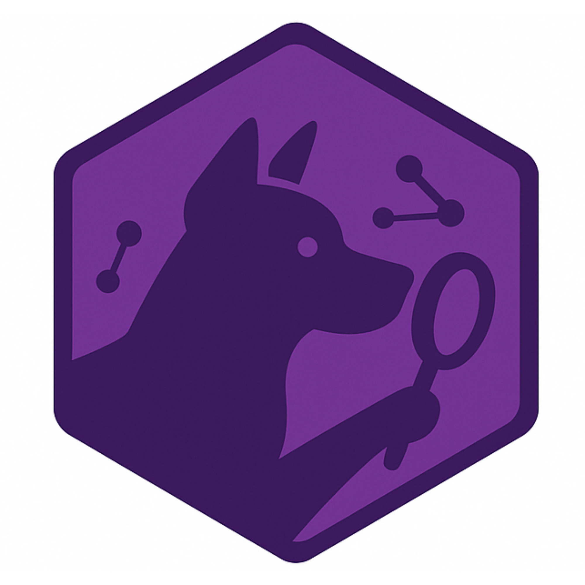

# RagEx

<div align="center">
  
</div>

[](https://github.com/your-org/rag_ex/actions/workflows/elixir.yml)
[](https://hex.pm/packages/rag_ex)
[](https://hexdocs.pm/rag_ex/)

**A production-ready RAG (Retrieval-Augmented Generation) daemon for Elixir applications**

RagEx is a standalone OTP application that watches your codebase, ingests code chunks with embeddings, and exposes a local HTTP API for coding agents. Built with Elixir's fault-tolerant supervision trees and designed for high-performance vector similarity search.

## Features

- **Real-time Code Ingestion**: Automatically watches file system changes and ingests code chunks
- **Vector Similarity Search**: High-performance cosine similarity search using Nx tensors
- **MMR Algorithm**: Maximal Marginal Relevance for diverse, non-redundant context selection
- **Token Budget Management**: Intelligent context packing within specified token limits
- **HTTP API**: RESTful endpoints for search, context retrieval, and ingestion control
- **SQLite Storage**: Efficient local storage with proper indexing and WAL mode
- **Production Ready**: Built with OTP supervision trees, proper error handling, and graceful degradation

## Table of Contents

- [Installation](#installation)
- [Quick Start](#quick-start)
- [Configuration](#configuration)
- [API Reference](#api-reference)
- [AI Integration](#ai-coding-assistant-integration)
- [Architecture](#architecture)
- [Development](#development)
- [Contributing](#contributing)
- [License](#license)

> **Note**: This README provides an overview. For detailed documentation, see the tabbed sections:
> - **[API Reference](.github/README-API.md)** - Complete API documentation with examples
> - **[AI Integration](.github/README-INTEGRATION.md)** - Integration with Cursor, VS Code, Windsurf, and Zed
> - **[Configuration](.github/README-CONFIG.md)** - Detailed configuration options and examples
> - **[Contributing](.github/README-CONTRIBUTING.md)** - Guidelines for contributing to RagEx
> - **[License](.github/README-LICENSE.md)** - MIT License and legal information

## Installation

### Prerequisites

- Elixir 1.16+ and Erlang/OTP 27+
- SQLite3 development libraries
- Git (for cloning)

### From Source

```bash
git clone https://github.com/your-org/rag_ex.git
cd rag_ex
mix deps.get
mix compile
```

### As a Dependency

Add to your `mix.exs`:

```elixir
def deps do
  [
    {:rag_ex, "~> 0.1.0"}
  ]
end
```

## Quick Start

### 1. Database Setup

```bash
# Create and migrate the database
mix ecto.create
mix ecto.migrate
```

### 2. Start the Daemon

```bash
# Start with default settings
mix run --no-halt

# Or run as a release
mix release
_build/prod/rel/rag_ex/bin/rag_ex start
```

### 3. Test the API

```bash
# Health check
curl http://localhost:7788/health

# Search for code
curl "http://localhost:7788/v1/search?query=function%20definition&k=5"

# Get context for coding
curl "http://localhost:7788/v1/context?query=authentication&budget=2000"
```

## Configuration

Basic configuration is handled through environment variables and `config/config.exs`. 
For detailed configuration options [Configuration Guide](README-CONFIG.md).

### Quick Setup

```elixir
# config/config.exs
import Config

config :rag_ex,
  ecto_repos: [RagEx.Repo],
  port: System.get_env("RAG_EX_PORT", "7788") |> String.to_integer(),
  root: System.get_env("RAG_EX_ROOT", File.cwd!()),
  repo_id: System.get_env("RAG_EX_REPO_ID", Path.basename(File.cwd!()))

config :rag_ex, RagEx.Repo,
  database: Path.expand("data/rag_ex.sqlite3", File.cwd!()),
  pool_size: 5
```

## AI Coding Assistant Integration

RagEx integrates seamlessly with popular AI coding assistants including Cursor, VS Code Copilot, Windsurf, and Zed. 
For detailed integration guides and examples, see [AI Integration Guide](README-INTEGRATION.md).

### Quick Start

1. **Start RagEx**: `mix run --no-halt`
2. **Configure your editor** using the integration guides
3. **Start coding** with context-aware AI assistance

### Supported Editors

- **Cursor**: `.cursorrules` configuration and custom extensions
- **VS Code**: Official extension with commands and keybindings
- **Windsurf**: Context provider configuration and plugins
- **Zed**: Lua plugin with settings integration
- **Universal**: Bash script for any editor supporting custom commands

## API Reference

RagEx provides a simple HTTP API for code search and context retrieval. 
For complete API documentation with examples, see [API Reference](README-API.md).

### Quick Examples

```bash
# Health check
curl http://localhost:7788/health

# Search for code
curl "http://localhost:7788/v1/search?query=authentication&k=5"

# Get context
curl "http://localhost:7788/v1/context?query=user%20management&budget=2000"

# Trigger ingestion
curl -X POST http://localhost:7788/v1/ingest
```

## Architecture

### Core Components

```
┌─────────────────┐    ┌─────────────────┐    ┌─────────────────┐
│   FileSystem    │───▶│   Ingestor      │───▶│   SQLite DB     │
│   Watcher       │    │   (Chunking +   │    │   (Embeddings)  │
│                 │    │    Embeddings)  │    │                 │
└─────────────────┘    └─────────────────┘    └─────────────────┘
                                │                        │
                                ▼                        ▼
┌─────────────────┐    ┌─────────────────┐    ┌─────────────────┐
│   HTTP API      │◀───│   Query Engine  │◀───│   Vector Search │
│   (REST)        │    │   (MMR + Pack)  │    │   (Cosine Sim)  │
└─────────────────┘    └─────────────────┘    └─────────────────┘
```

### Data Flow

1. **File System Monitoring**: Watches for file changes with debounced updates
2. **Code Chunking**: Breaks files into semantic chunks (modules, functions, etc.)
3. **Embedding Generation**: Creates vector embeddings for each chunk
4. **Storage**: Stores chunks and embeddings in SQLite with proper indexing
5. **Query Processing**: Vector similarity search with MMR for diverse results
6. **Context Packing**: Intelligent selection within token budgets

### Database Schema

```sql
CREATE TABLE code_chunks (
  id INTEGER PRIMARY KEY,
  repo_id TEXT NOT NULL,
  path TEXT NOT NULL,
  chunk_ix INTEGER NOT NULL,
  lang TEXT NOT NULL,
  sym TEXT NOT NULL,
  text TEXT NOT NULL,
  embedding BLOB,
  sha TEXT NOT NULL,
  tok_count INTEGER DEFAULT 0,
  meta JSON DEFAULT '{}',
  inserted_at DATETIME,
  updated_at DATETIME,
  UNIQUE(repo_id, path, chunk_ix)
);

CREATE INDEX idx_code_chunks_repo_path ON code_chunks(repo_id, path);
```

## Development

### Running Tests

```bash
# Run all tests
mix test

# Run with coverage
mix test --cover

# Run specific test
mix test test/rag_ex_test.exs:30
```

### Development Server

```bash
# Start with auto-reload
iex -S mix

# Start daemon in development
mix run --no-halt
```

### Building Releases

```bash
# Build release
mix release

# Run release
_build/prod/rel/rag_ex/bin/rag_ex start

# Run with custom config
_build/prod/rel/rag_ex/bin/rag_ex start --root /path/to/repo --port 8080
```

### CLI Options

```bash
# One-time ingestion
mix run -e "RagEx.CLI.main([\"--once\"])"

# Custom root directory
mix run -e "RagEx.CLI.main([\"--root\", \"/path/to/repo\"])"

# Custom port
mix run -e "RagEx.CLI.main([\"--port\", \"8080\"])"
```

## Performance Tuning

### Database Optimization

```elixir
# config/prod.exs
config :rag_ex, RagEx.Repo,
  database: "/var/lib/rag_ex/data/production.sqlite3",
  pool_size: 20,
  timeout: 30_000,
  queue_target: 5_000,
  queue_interval: 1_000
```

### Memory Management

```elixir
# config/prod.exs
config :rag_ex,
  # Adjust based on your embedding model
  embedding_dimensions: 384,
  # Batch size for embedding generation
  embedding_batch_size: 10,
  # Maximum chunks to process per ingestion
  max_chunks_per_ingestion: 1000
```

### Monitoring

```elixir
# Add to your supervision tree
defmodule MyApp.Application do
  use Application

  def start(_type, _args) do
    children = [
      # ... other children
      RagEx.Application,
      # Add monitoring
      {TelemetryUI, port: 4001}
    ]
    
    Supervisor.start_link(children, strategy: :one_for_one)
  end
end
```

## Troubleshooting

### Common Issues

**Database locked errors:**
```bash
# Check for running processes
ps aux | grep rag_ex

# Kill stuck processes
pkill -f rag_ex

# Reset database
rm data/rag_ex.sqlite3*
mix ecto.create
mix ecto.migrate
```

**Port already in use:**
```bash
# Find process using port
lsof -i :7788

# Kill process
kill -9 <PID>

# Or use different port
mix run --no-halt -e "Application.put_env(:rag_ex, :port, 8080)"
```

**File watcher not working:**
- On macOS: Install `fswatch` or use polling mode
- On Linux: Ensure inotify limits are sufficient
- Check file permissions on watched directories

### Debug Mode

```elixir
# Enable debug logging
config :logger, level: :debug

# Enable Ecto query logging
config :rag_ex, RagEx.Repo, log: :debug
```

## Contributing

We welcome contributions! For detailed guidelines, see [Contributing Guide](.github/README-CONTRIBUTING.md).

### Quick Start

1. Fork the repository
2. Create a feature branch: `git checkout -b feature/amazing-feature`
3. Make your changes and add tests
4. Run the test suite: `mix test`
5. Open a Pull Request

## License

This project is licensed under the MIT License. For complete license information, see [License](.github/README-LICENSE.md).

## Acknowledgments

- Built with [Elixir](https://elixir-lang.org/) and [OTP](https://www.erlang.org/doc/design_principles/des_princ.html)
- Vector operations powered by [Nx](https://github.com/elixir-nx/nx)
- Database layer provided by [Ecto](https://hexdocs.pm/ecto/Ecto.html)
- HTTP server built with [Plug.Cowboy](https://hexdocs.pm/plug_cowboy/Plug.Cowboy.html)

---

**Made with love by the RagEx team**